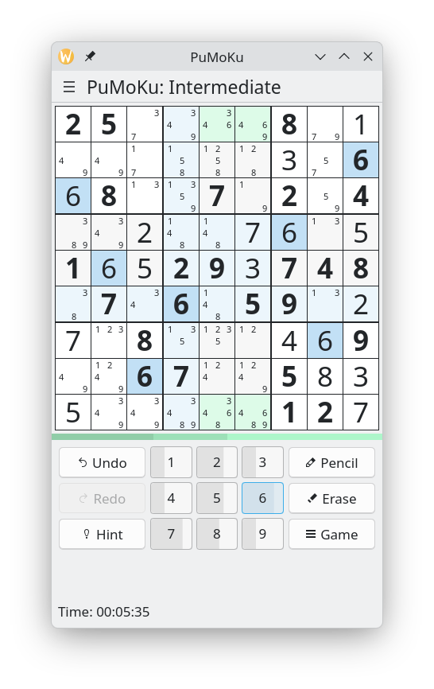

<!--
SPDX-FileCopyrightText: 2024 Anders Lund <anders@alweb.dk>
SPDX-License-Identifier: CC0-1.0
-->

# PuMoKu

PuMoKu is a classic, 9x9 pumoku solving game aimed at Plasma Mobile. It comes with flexible highlighting options and (touch) input methods, full undo stack and more.

 

## Status

This project is in beta state. It compiles, play is functional, but will not save/load files, and some features are missing as of 2025/11/21.

## Build and install

```
git clone https://invent.kde.org/alund/pumoku.git
mkdir build
cd build
cmake ../pumoku
make
make install
```

You may skip the install step and just run /path/to/build/bin/pumoku

## Contributing

Contributing are wellcome - code, patches, ideas, thoughts, translations. Please read the Notes.md file if you think about helping out.

Code is kept in https://invent.kde.org/alund/pumoku/

The [KDE Community Code](https://kde.org/code-of-conduct) of Conduct is applied.

## License

This project is licensed mainly under the GPL-2.1-or-later. More information can be found in the LICENSES folder.

## Authors

Anders Lund, anders@alweb.dk
